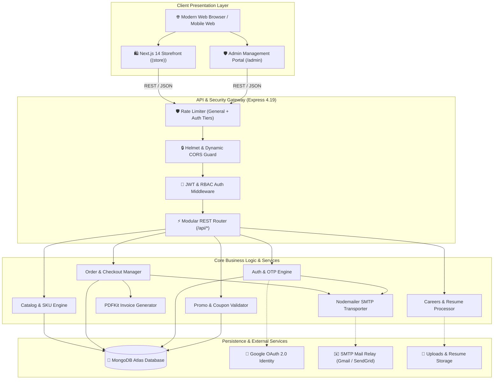
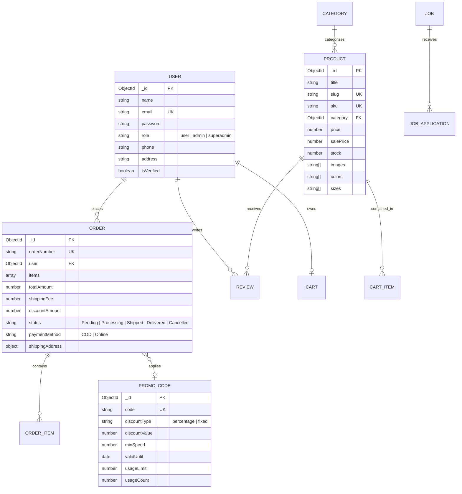

<div align="center">

<a href="https://github.com/JoyTarafder/Online_Shopping">
  
</a>

# 🛍️ ShajSutro (সাজসূত্র)
### Next-Generation Omnichannel E-Commerce & Retail Management Engine

[](https://github.com/JoyTarafder/Online_Shopping)
[](LICENSE)
[](https://nextjs.org/)
[](https://reactjs.org/)
[](https://www.typescriptlang.org/)
[](https://tailwindcss.com/)
[](https://nodejs.org/)
[](https://expressjs.com/)
[](https://www.mongodb.com/)

<p align="center">
  <b>Enterprise-ready, cloud-native digital storefront and back-office management suite tailored for high-scale fashion and lifestyle commerce.</b>
</p>

<p align="center">
  <a href="#-executive-summary">Executive Summary</a> •
  <a href="#-system-architecture">System Architecture</a> •
  <a href="#-core-modules--feature-matrix">Feature Matrix</a> •
  <a href="#-security--compliance-architecture">Security</a> •
  <a href="#-data-models--entity-relationships">Data Models</a> •
  <a href="#-rest-api-specification">REST API</a> •
  <a href="#-environment-configuration">Configuration</a> •
  <a href="#-getting-started--deployment">Deployment</a>
</p>

---

</div>

## 📌 Executive Summary

**ShajSutro** is a modern, full-stack headless e-commerce ecosystem designed to solve the challenges of contemporary digital retail. It pairs an ultra-fast, search-optimized **Next.js 14 App Router** frontend with a robust, defensively architected **Express.js & MongoDB Atlas** micro-service backend.

The platform delivers a frictionless customer shopping journey alongside an operations hub featuring real-time business intelligence, dynamic logistics calculation (specialized for Bangladesh administrative divisions & districts), automated PDF invoice generation, multi-channel transactional notifications, and an integrated career management workflow.

### 🌟 Key Differentiators

* **⚡ Ultra-Low Latency UI**: Server-side rendering (SSR) & streaming hydration with React 18 and Next.js 14.
* **📍 Hyper-Localized Logistics Engine**: Native support for 8 Divisions, 64 Districts, and Upazilas with automatic shipping tier calculations.
* **🛡️ Zero-Trust Security Foundation**: Helmet security headers, dual-tier rate limiters, bcrypt hashing, and JWT token rotation.
* **📊 Live Operations Analytics**: Real-time sales telemetry, order trend graphs, and inventory metrics via Recharts.
* **📑 Automated PDF Invoicing**: High-fidelity dynamic PDF generation built with PDFKit for immediate customer receipts and warehouse dispatch.
* **👗 Interactive Virtual Try-On *(Future Plan / POC in Progress)*:** Dedicated studio interface for interactive apparel preview and virtual fitting.

---

## 🏗️ System Architecture



---

## 🎯 Core Modules & Feature Matrix

### 🛍️ 1. Customer Experience (Storefront)

| Capability | Technical Implementation | Highlights |
|---|---|---|
| **Catalog & Navigation** | Next.js dynamic routing, query state sync | Multi-facet filtering by category, price range, color swatches, sizes, and instant client search. |
| **Product Detail Experience** | Responsive gallery, dynamic stock check | High-res image carousel, color/size variant selectors, customer reviews, verified buyer badges, and related items. |
| **Interactive Virtual Try-On** <br/>*(Future Plan / POC in Progress)* | Canvas / Web interactive studio (`/virtual-try-on`) | In-development interactive apparel preview and virtual fitting room module designed to enhance customer confidence and reduce return rates. |
| **Cart & Wishlist** | React Context + LocalStorage persistence | Real-time stock reservation check, coupon validation drawer, and sync across page reloads. |
| **Localized Checkout** | BD Administrative Location Dataset | Automated shipping fee differentiation (Inside Dhaka vs. Outside Dhaka / Inter-division rates), Cash on Delivery (COD) & Online payments. |
| **Real-Time Order Tracking** | Public API lookup (`/api/orders/track`) | Order lookup by Tracking ID + Phone/Email with visual timeline (`Pending` ➔ `Processing` ➔ `Shipped` ➔ `Delivered`). |
| **Customer Portal** | JWT Auth with session protection | Profile updating, saved address books, order tracking, and dynamic PDF invoice downloads. |
| **Interactive Careers Portal** | Multipart file upload via Multer | Open positions browser with direct PDF resume / CV attachment processing. |

---

### 🛡️ 2. Back-Office Operations (Admin Suite)

| Administrative Module | Route | Capabilities |
|---|---|---|
| **Executive Analytics** | `/admin/dashboard` | Visual KPI tracking (Gross Sales, Net Revenue, Monthly Trends, Top 5 Products, Low-Stock Warnings) rendered with **Recharts**. |
| **Catalog Management** | `/admin/products` | Add/Edit/Archive SKUs, multi-image upload handler, variant pricing, color mapping, automated SKU generation. |
| **Category Hierarchy** | `/admin/categories` | Dynamic nested categories, automated URL slugification, and icon management. |
| **Order Processing** | `/admin/orders` | Order state machine transitions, customer contact records, shipping manifests, and **instant PDF invoice generation**. |
| **Promotions Engine** | `/admin/promo-codes` | Percentage vs. fixed amount discounts, expiry thresholds, minimum spend constraints, and total redemption limits. |
| **Talent Acquisition** | `/admin/applications` | Review incoming candidate resumes, track screening statuses, and download CV files directly. |
| **Customer Communications** | `/admin/messages` | Centralized customer inquiry inbox with read/unread flags and message threading. |
| **System Notifications** | `/admin/notifications` | Real-time in-app alerts for critical order events, out-of-stock items, and applicant actions. |
| **Audience Growth** | `/admin/subscribers` | Newsletter subscriber registry with automated welcome discount coupon dispatch. |

---

## 🔒 Security & Compliance Architecture

```
                                    Security Defense In-Depth
 ┌─────────────────────────────────────────────────────────────────────────────────────────┐
 │ 1. Boundary Defense: Helmet.js HTTP Headers + Strict Cross-Origin Policies              │
 ├─────────────────────────────────────────────────────────────────────────────────────────┤
 │ 2. Denial-of-Service Defense: Tiered Rate Limiting (General: 500/15m | Auth: 25/15m)   │
 ├─────────────────────────────────────────────────────────────────────────────────────────┤
 │ 3. Authentication: Cryptographic Bcrypt Salting (10 Rounds) + JWT with expiry validation│
 ├─────────────────────────────────────────────────────────────────────────────────────────┤
 │ 4. Authorization: Role-Based Access Control (RBAC) across User, Admin, Superadmin       │
 ├─────────────────────────────────────────────────────────────────────────────────────────┤
 │ 5. Data Sanitization: Parameter verification, Mongoose schema casting, XSS mitigation   │
 └─────────────────────────────────────────────────────────────────────────────────────────┘
```

1. **Anti-Brute Force Protection**: Dedicated rate limiter on `/api/auth/*` prevents dictionary and credential-stuffing attacks.
2. **Double-Opt-In Verification**: New customer registrations are held in a staging collection (`PendingUser`) and committed to the main `User` collection only upon valid OTP validation.
3. **CORS Governance**: Dynamic whitelisting supporting localhost, production domains, and preview subdomains (`*.vercel.app`).
4. **Credential Isolation**: Zero plaintext password exposure; sensitive tokens sanitized from all API responses.

---

## 🗄️ Data Models & Entity Relationships



---

## 🔌 REST API Specification

### Authentication & User Lifecycle (`/api/auth`)

| Endpoint | Verb | Auth | Body / Query | Description |
|---|---|---|---|---|
| `/register` | `POST` | Public | `{ name, email, password, phone }` | Initiates registration & dispatches 6-digit OTP |
| `/verify-email` | `POST` | Public | `{ email, otp }` | Validates OTP and creates activated user account |
| `/resend-otp` | `POST` | Public | `{ email }` | Dispatches fresh OTP code |
| `/login` | `POST` | Public | `{ email, password }` | Authenticates user & returns JWT token + user profile |
| `/google` | `POST` | Public | `{ credential }` | Google OAuth token exchange & sign-in |
| `/forgot-password`| `POST` | Public | `{ email }` | Sends password reset token email |
| `/reset-password` | `POST` | Public | `{ token, password }` | Resets account password |
| `/me` | `GET` | Bearer | — | Fetches authenticated profile |
| `/profile` | `PUT` | Bearer | `{ name, phone, address, ... }` | Updates authenticated profile |

### Product Catalog & Categories (`/api/products`, `/api/categories`)

| Endpoint | Verb | Auth | Parameters / Body | Description |
|---|---|---|---|---|
| `/api/categories` | `GET` | Public | — | List all categories with active product counts |
| `/api/categories` | `POST` | Admin | `{ name, image, description }` | Create a new category |
| `/api/products` | `GET` | Public | `?category=&search=&sort=&page=` | Query catalog with pagination and faceted filters |
| `/api/products/:id`| `GET` | Public | `idOrSlug` | Retrieve product details by ID or URL slug |
| `/api/products` | `POST` | Admin | `{ title, price, stock, category, images... }` | Create product with auto-generated SKU |
| `/api/products/:id`| `PUT` | Admin | Product updates | Update product pricing, images, or stock |
| `/api/products/:id`| `DELETE`| Admin | — | Remove product from catalog |

### Orders & Checkout (`/api/orders`)

| Endpoint | Verb | Auth | Body / Params | Description |
|---|---|---|---|---|
| `/api/orders` | `POST` | Public/User | `{ items, shippingAddress, promoCode, paymentMethod }` | Places customer order & triggers confirmation email |
| `/api/orders/track`| `POST` | Public | `{ orderNumber, query }` | Public order lookup with status progression |
| `/api/orders/my-orders` | `GET` | Bearer | — | Customer order history |
| `/api/orders/:id/invoice`| `GET` | User/Admin | `orderId` | Generates and streams dynamic PDF invoice |
| `/api/orders` | `GET` | Admin | `?status=&page=&limit=` | Admin master order ledger |
| `/api/orders/:id/status` | `PUT` | Admin | `{ status }` | Transitions order state & dispatches status notification |

### Operations, Marketing & Support

| Endpoint | Verb | Auth | Description |
|---|---|---|---|
| `/api/promo-codes/validate` | `POST` | Public | Validates coupon rules against current cart state |
| `/api/promo-codes` | `POST` | Admin | Creates promotional discount campaign |
| `/api/job-applications` | `POST` | Public (Multer) | Receives job candidate application with PDF resume |
| `/api/job-applications` | `GET` | Admin | Lists applicants with resume preview links |
| `/api/contact` | `POST` | Public | Ingests customer support message |
| `/api/newsletter/subscribe`| `POST` | Public | Registers subscriber & sends welcome promo code |
| `/api/stats/overview` | `GET` | Admin | Aggregated analytics telemetry (sales, revenue, orders) |
| `/api/notifications` | `GET` | Admin | Live administrative notification feed |

---

## ⚙️ Environment Configuration

### Frontend Settings: `.env.local`
Place this in the root project directory:

```ini
# ==============================================================================
# SHAJSUTRO FRONTEND CONFIGURATION
# ==============================================================================

# Backend REST API Base URL (Without trailing slash)
NEXT_PUBLIC_API_URL=http://localhost:4000

# Google OAuth 2.0 Client ID (Obtained from Google Cloud Console)
NEXT_PUBLIC_GOOGLE_CLIENT_ID=your-google-client-id.apps.googleusercontent.com
```

### Backend Settings: `backend/.env`
Place this in the `backend/` directory:

```ini
# ==============================================================================
# SHAJSUTRO BACKEND CONFIGURATION
# ==============================================================================

# Environment & Server Port
PORT=4000
NODE_ENV=development

# MongoDB Connection String (Atlas Cluster or Local Instance)
MONGODB_URI=mongodb+srv://<username>:<password>@cluster0.mongodb.net/shajsutro?retryWrites=true&w=majority

# JSON Web Token Secret & Expiry
JWT_SECRET=super_secret_jwt_encryption_key_change_in_production_min_32_chars
JWT_EXPIRE=7d

# CORS Allowed Client Domains (Comma-separated)
CLIENT_URL=http://localhost:3000,http://localhost:3001,https://your-production-domain.com

# SMTP Mail Dispatcher Configuration
SMTP_HOST=smtp.gmail.com
SMTP_PORT=587
SMTP_SECURE=false
SMTP_USER=your-business-email@gmail.com
SMTP_PASS=your-gmail-app-password
EMAIL_FROM="ShajSutro <no-reply@shajsutro.com>"

# File Upload Storage Directory
UPLOAD_DIR=uploads
```

---

## 🚀 Getting Started & Deployment

### 1. Prerequisites Check
* **Node.js**: `v20.x LTS` recommended (minimum `v18.17.0`)
* **npm**: `v9.x` or `v10.x`
* **MongoDB**: Atlas Cloud Cluster or Local Community Server

---

### 2. Local Development Setup

```bash
# 1. Clone the repository
git clone https://github.com/JoyTarafder/Online_Shopping.git
cd Online_Shopping

# 2. Install root & frontend dependencies
npm install

# 3. Install backend dependencies
cd backend
npm install
cd ..
```

---

### 3. Database Initialization & Seeding

```bash
cd backend

# Create Initial Superadmin User
npx ts-node src/seed/createAdmin.ts

# Populate Demo Catalog (Categories, Products, Images)
npx ts-node src/seed/createDemoProducts.ts

# (Optional) Verify SMTP Transporter Connectivity
npx ts-node src/seed/testEmailTransporter.ts

cd ..
```

---

### 4. Running the Complete Development Cluster

Open two terminal sessions:

#### Terminal 1: Backend API Engine
```bash
cd backend
npm run dev
# -> Express server active at http://localhost:4000
```

#### Terminal 2: Next.js Frontend Application
```bash
# From workspace root
npm run dev
# -> Storefront active at http://localhost:3000
# -> Admin Portal active at http://localhost:3000/admin
```

---

## 📦 Production Build & Deployment

### Frontend (Vercel)
1. Push codebase to GitHub/GitLab.
2. Import project into **Vercel**.
3. Set **Framework Preset**: `Next.js`.
4. Inject environment variables:
   * `NEXT_PUBLIC_API_URL` ➔ `https://api.yourdomain.com`
   * `NEXT_PUBLIC_GOOGLE_CLIENT_ID` ➔ `your-client-id`
5. Trigger build (`npm run build`).

### Backend (Render / Railway / DigitalOcean / AWS EC2)
1. Provision a Node.js runtime container.
2. Configure environment variables matching `backend/.env`.
3. Set Build Command:
   ```bash
   npm install && npm run build
   ```
4. Set Start Command:
   ```bash
   npm run start
   ```
5. Configure reverse proxy (e.g. NGINX) with SSL termination via Let's Encrypt.

---

## 🧪 Quality Assurance & Scripts

| Scope | Command | Purpose |
|---|---|---|
| **Frontend** | `npm run build` | Validates TypeScript types and outputs optimized Next.js bundle |
| **Frontend** | `npm run lint` | Runs Next.js ESLint verification |
| **Backend** | `npm run build` | Compiles TypeScript into production JavaScript in `dist/` |
| **Backend** | `npm run lint` | Validates TypeScript types without code emission (`tsc --noEmit`) |
| **Backend** | `npm run start` | Boots compiled high-performance Node.js production server |

---

## 🤝 Contributing Guidelines

1. **Fork the Repository** & create a feature branch (`git checkout -b feature/amazing-feature`).
2. **Commit Changes** following [Conventional Commits](https://www.conventionalcommits.org/) (`feat: add multi-currency support`).
3. **Push to Branch** (`git push origin feature/amazing-feature`).
4. **Open a Pull Request** against the `main` branch.

---

## 📄 License

Distributed under the **MIT License**. See `LICENSE` for more information.

---

<div align="center">
  <sub>Engineered with precision for the modern retail landscape.</sub>
  <br />
  <b>© 2026 ShajSutro. All rights reserved.</b>
</div>
